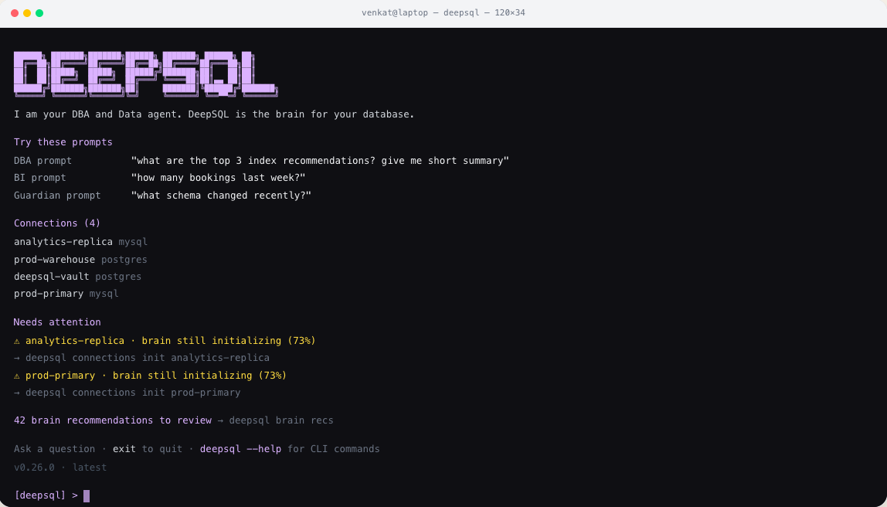

# DeepSQL



**The database agent for Postgres and MySQL.** Point it at PostgreSQL or MySQL and ask
questions in plain English — schema exploration, query generation, slow query analysis,
index recommendations, generated dashboards.

**You bring the model.** DeepSQL ships with no model provider of its own and no vendor
account to sign up for. You point it at OpenAI, Azure OpenAI, a LiteLLM proxy, or a model
running on your own hardware, and it uses that. Everything else runs in your environment:
database credentials are encrypted in a local vault, and nothing leaves the machines you
control except the prompts you send to the endpoint you chose.

📄 **[Read the whitepaper](https://deepsql.ai/whitepaper)** — the architecture and the
reasoning behind it.

---

## Quick start

Five steps, in order. Budget about fifteen minutes, most of it waiting on the first build.

### 1. Check you have what you need

- **Docker Engine** with Compose v2 **and buildx** — verify with `docker compose version`
  and `docker buildx version`. Compose delegates builds to buildx and refuses anything
  older than 0.17.0.
- **`git`**, **`curl`** and **`openssl`**
- **~4 GB of memory available to Docker.** The backend JVM is configured with a 3 GB max
  heap, so a smaller allocation fails in ways that look unrelated.
- **An API key for a model provider.** See step 3 — you need this before you start, not
  after.

**On a fresh server, one command does all of that:**

```bash
sudo ./scripts/self-host/bootstrap-server.sh
```

It handles Debian/Ubuntu and Amazon Linux 2023 / RHEL, installs whatever is missing, and
verifies the result before exiting. Worth running even where Docker is already present: a
stock `dnf install docker` on Amazon Linux 2023 ships **neither** the Compose plugin
**nor** a buildx new enough to build, and the resulting failure surfaces much later, at
`docker compose up --build`, naming neither.

### 2. Get the code

There are no prebuilt images and no container registry. Compose builds the backend and
frontend from your checkout.

```bash
git clone https://github.com/DeepSQLAI/deepsql.git
cd deepsql
cp .env.example .env
```

### 3. Choose your model

This is the step that matters, and the one thing DeepSQL cannot decide for you.

Open `.env` and set the chat group. Whatever you pick, the provider id stays `openai` —
there is one provider implementation and it speaks OpenAI, Azure OpenAI, and every
OpenAI-compatible server. It dispatches on the **shape of your endpoint**, not on a name
you configure.

| Variable | What to put in it |
|---|---|
| `DEEPSQL_CHAT_PROVIDER` | `openai` — always, for every provider below |
| `DEEPSQL_CHAT_API_KEY` | Your key. For a local model, any non-empty string. |
| `DEEPSQL_CHAT_ENDPOINT` | The base URL. **No working default — set it explicitly.** |
| `DEEPSQL_CHAT_MODEL` | Model name, or your Azure *deployment* name |

Pick the one that matches you:

<details open>
<summary><b>OpenAI</b></summary>

```env
DEEPSQL_CHAT_PROVIDER=openai
DEEPSQL_CHAT_API_KEY=sk-your-key
DEEPSQL_CHAT_ENDPOINT=https://api.openai.com/v1
DEEPSQL_CHAT_MODEL=gpt-4o
```
</details>

<details>
<summary><b>Azure OpenAI</b></summary>

An `.azure.com` or `.azure-api.net` endpoint switches authentication to the `api-key`
header automatically. `_MODEL` is your **deployment** name, not the model name.

```env
DEEPSQL_CHAT_PROVIDER=openai
DEEPSQL_CHAT_API_KEY=your-azure-openai-key
DEEPSQL_CHAT_ENDPOINT=https://your-resource.cognitiveservices.azure.com/
DEEPSQL_CHAT_MODEL=your-deployment-name
```
</details>

<details>
<summary><b>Anthropic</b></summary>

Anthropic serves an OpenAI-compatible `/v1/chat/completions`, so it needs no gateway. It
publishes no embeddings API, so pair it with another provider for embeddings (step 4).

```env
DEEPSQL_CHAT_PROVIDER=openai
DEEPSQL_CHAT_API_KEY=sk-ant-your-key
DEEPSQL_CHAT_ENDPOINT=https://api.anthropic.com/v1
DEEPSQL_CHAT_MODEL=claude-haiku-4-5-20251001
```
</details>

<details>
<summary><b>Ollama, vLLM, LM Studio, TGI — your own hardware</b></summary>

Anything speaking the OpenAI wire format. No key is required, but the variable must be
non-empty.

```env
DEEPSQL_CHAT_PROVIDER=openai
DEEPSQL_CHAT_API_KEY=ollama
DEEPSQL_CHAT_ENDPOINT=http://host.docker.internal:11434/v1
DEEPSQL_CHAT_MODEL=llama3.1
```
</details>

<details>
<summary><b>LiteLLM proxy</b></summary>

Point at the proxy, authenticate with a virtual key, use your own alias. Chat, embeddings
and brain initialisation are verified end to end against a self-hosted LiteLLM.

```env
DEEPSQL_CHAT_PROVIDER=openai
DEEPSQL_CHAT_API_KEY=sk-your-litellm-virtual-key
DEEPSQL_CHAT_ENDPOINT=http://litellm:4000/v1
DEEPSQL_CHAT_MODEL=your-alias
```

**Name your alias carefully.** `_USE_RESPONSES_API` defaults to `auto`, which decides from
the **model name** rather than from what your endpoint implements. An alias beginning
`gpt-5`, `o1`, `o3`, `o4` or `codex` selects the Responses API. If your gateway does not
serve `/v1/responses`, avoid those prefixes or set `DEEPSQL_CHAT_USE_RESPONSES_API=false`.
</details>

> `DEEPSQL_CHAT_PROVIDER` gates the whole group: with it unset, **no other `DEEPSQL_CHAT_*`
> variable is read**. That is the most common reason a carefully filled-in `.env` appears to
> be ignored.

### 4. Add embeddings (recommended)

Configured independently of chat, so they can point at a different provider, key or
endpoint — which is exactly what you need when your chat model has no embeddings API.

```env
DEEPSQL_EMBEDDING_PROVIDER=openai
DEEPSQL_EMBEDDING_API_KEY=sk-your-key
DEEPSQL_EMBEDDING_ENDPOINT=https://api.openai.com/v1
DEEPSQL_EMBEDDING_MODEL=text-embedding-3-large
```

Skipping this is survivable — the app starts and retrieval falls back to keyword-only — but
answer quality drops noticeably, so treat it as part of setup rather than an extra.

**Your embedding model must produce 3072-dimension vectors.** `rag_documents.embedding` is a
single `vector(3072)` column shared by every connection, so `text-embedding-3-small` (1536)
is rejected. Changing width means migrating the column.

### 5. Install and log in

```bash
./scripts/self-host/install.sh
```

The installer generates your JWT secret, the credential-vault encryption key and the vault
DB password, prompts for the first admin account, builds both images, starts the stack, and
verifies pgvector is live. Unless you set `DEEPSQL_SKIP_AGENT_SETUP=1`, it also runs
[`scripts/self-host/setup-agent.sh`](scripts/self-host/setup-agent.sh) to install Hermes under
`~/.hermes/`, wire DeepSQL MCP, and start the webui on `0.0.0.0:8787` (required for the
**Agent** tab and AI dashboard generation).

**The first build takes several minutes** — it compiles the Spring Boot backend with Maven
inside the container and bundles the frontend with Vite. It has not hung. Later builds reuse
the Docker layer cache.

Then open **http://localhost:3000** and log in with the admin email and password you entered.

> **Back up `ENCRYPTION_KEY` from `.env` now.** It encrypts every database credential you
> store. Lose it and you re-enter all of them — there is no recovery path.

---

<details>
<summary><b>Prefer to drive Compose yourself?</b></summary>

`.env.example` ships two values empty on purpose — they are validated secrets, not free
text, and the backend refuses to start without them.

```bash
printf 'SECURITY_JWT_SECRET=%s\n' "$(openssl rand -base64 64 | tr -d '\n')" >> .env
printf 'ENCRYPTION_KEY=%s\n'      "$(openssl rand -base64 32)"             >> .env

docker compose up -d --build
```

That builds and starts everything but leaves you unable to log in: there is no seeded
account, self-service signup is disabled, and the wizard's `POST /setup/initialize` is
disabled. The first user is created through a **localhost-only bootstrap endpoint** — set
`SECURITY_ADMIN_BOOTSTRAP_ENABLED=true` and `ADMIN_BOOTSTRAP_SECRET` in `.env` and call it
yourself. `install.sh` does exactly this, then turns the flag back off.
</details>

---

## What it does

Your 24/7 DBA and data engineer. It answers BI questions, fixes slow queries, and watches
your schema — all from one shared brain.

- **Answers BI questions.** Ask in plain English. The agent loads your business context,
  resolves the schema, drafts and validates SQL, then executes it read-only — with every
  step you can inspect. The hand-written SQL editor is the only path that can mutate, and
  only for a confirming admin.
- **Fixes slow queries.** Reads `pg_stat_statements` or the MySQL slow log, groups queries
  by fingerprint, ranks them by cost, and flags regressions against their baseline.
- **Index recommendations.** Advises, and can apply them for you — `CREATE INDEX
  CONCURRENTLY` on PostgreSQL, so no table lock.
- **Watches your schema.** Tracks what changed and what needs attention, so drift surfaces
  before it breaks a query or a dashboard.
- **A brain that knows your business.** Teach it your metrics, rules and conventions once —
  MRR, active accounts, currency handling — and every query, dashboard and recommendation
  uses the same governed definitions.
- **Dashboards without the analyst backlog.** An agent writes a single self-contained HTML
  document, rendered in a sandboxed iframe with no network access. It reads data only
  through a read-only query bridge back to the backend — the agent gets creative freedom,
  the database keeps its guard rail.
- **Ask it from anywhere.** The web UI, your terminal, or a Slack channel. The MCP server
  gives coding agents (Claude Code, Cursor, Codex, Claude Desktop) the same capabilities
  over stdio.
- **Postgres and MySQL, in your infra.** One dialect registry, read-only execution, and SSH
  tunnelling to reach databases behind a bastion.

---

## Operating the stack

```bash
./scripts/self-host/status.sh                    # compose ps + health probes
./scripts/self-host/smoke-test.sh                # end-to-end check against the vault DB
./scripts/self-host/seed-demo-data.sh            # seed demo e-commerce database for exploration
./scripts/self-host/uninstall.sh                 # stop and remove containers, keep data
./scripts/self-host/uninstall.sh --purge-data    # also drop the volumes
```

### Demo Database

To explore DeepSQL features without connecting your own database, run:

```bash
./scripts/self-host/seed-demo-data.sh
```

This creates a **demo_shop** e-commerce database with:
- 100 products, 500 customers, 5,000+ orders
- Intentionally suboptimal query patterns (to trigger recommendations)
- Pre-configured slow query analysis and index recommendations
- Sample saved queries in the SQL Editor
- Sample agent conversation history

Alternatively, set `DEEPSQL_SEED_DEMO_DATA=1` in `.env` before running `install.sh` to seed automatically.

Upgrading:

```bash
git pull && docker compose up -d --build
```

### Ports

| Service  | Port | Override                |
|----------|------|-------------------------|
| Frontend | 3000 | `DEEPSQL_FRONTEND_PORT` |
| Backend  | 8080 | `DEEPSQL_BACKEND_PORT`  |
| Postgres | 5432 | `DEEPSQL_POSTGRES_PORT` |
| Valkey   | 6379 | `DEEPSQL_VALKEY_PORT`   |

### Configuration reference

Everything lives in `.env`, documented inline. The variables that matter most:

| Variable | Purpose |
|---|---|
| `DEEPSQL_CHAT_PROVIDER`, `_API_KEY`, `_ENDPOINT`, `_MODEL` | The chat model. Required. |
| `DEEPSQL_EMBEDDING_PROVIDER`, `_API_KEY`, `_ENDPOINT`, `_MODEL` | Embeddings for retrieval. Optional; without them retrieval is keyword-only. |
| `DEEPSQL_CHAT_TEMPERATURE`, `_API_VERSION`, `_USE_RESPONSES_API` | Optional chat tuning. `_USE_RESPONSES_API` is `true` / `false` / `auto`. |
| `SECURITY_JWT_SECRET` | Signs session tokens. Generate with `openssl rand -base64 64`. |
| `ENCRYPTION_KEY` — or `ENCRYPTION_KEYS` + `ENCRYPTION_KEY_ID` | AES-GCM key(s) for the credential vault. The backend refuses to start without one. |
| `DB_URL`, `DB_USERNAME`, `DB_PASSWORD` | The vault database. Compose points these at its own `postgres` service. |
| `SPRING_PROFILES_ACTIVE` | `prod` for self-hosting — hardened defaults. |
| `SECURITY_AUTH_ENABLED` | Set `false` only for local development. |
| `SECURITY_ADMIN_BOOTSTRAP_ENABLED`, `ADMIN_BOOTSTRAP_SECRET` | Gate the localhost-only first-admin endpoint. |
| `CORS_ALLOWED_ORIGINS` | Browser origins allowed to call the API. |
| `VECTOR_STORE_TYPE` | `pgvector` (the self-hosting default) or `azure`. |
| `EMBEDDING_FAIL_OPEN` | Whether a failed embedding call degrades silently or raises. |
| `SLACK_*`, `EMAIL_*` | Optional Slack bot and SMTP. |

### Telemetry

The backend can report anonymous install and usage counters to PostHog. **No project key
ships with this repository**, so the sink is a no-op unless you configure
`deepsql.telemetry.posthog-project-key` yourself. `DO_NOT_TRACK=1` or
`DEEPSQL_TELEMETRY_DISABLED=1` disables it outright, as does the admin toggle.

---

## MCP server

`mcp/` exposes 44 tools wrapping the backend API, so agents reuse the same orchestration,
retrieval and guardrails instead of getting raw database credentials. SQL execution is
read-only-enforced before it reaches the backend.

```bash
DEEPSQL_API_BASE_URL=http://localhost:8080/api/ \
DEEPSQL_AUTH_TOKEN=<your-deepsql-token> \
npm run mcp:phase1
```

It has no npm dependencies of its own — `npm run mcp:phase1` is just
`node mcp/deepsql-phase1-server.js`, so it runs straight from a fresh clone.

See [`mcp/README.md`](mcp/README.md) for the CLI, editor configuration and the full tool
table, and [`docs/root/MCP_PHASE1.md`](docs/root/MCP_PHASE1.md) for rollout notes.

---

## Development

Run the stateful dependencies in Docker — PostgreSQL needs the **pgvector** extension, which
is tedious to install by hand — and everything else natively for hot reload.

```bash
docker compose up -d postgres valkey    # requires .env to exist

cd backend && ./mvnw spring-boot:run    # http://localhost:8080/api
npm install && npm run dev              # http://localhost:3000
```

You need **JDK 25** and **Node 22**. Maven comes from the wrapper (`./mvnw`), which pins the
same version CI uses — no separate install.

The backend needs the same environment as the container: at minimum `DB_URL`, `DB_USERNAME`,
`DB_PASSWORD`, `SECURITY_JWT_SECRET`, `ENCRYPTION_KEY`, and the `DEEPSQL_CHAT_*` group.
Authentication is on by default in every profile and there is no `admin`/`admin` shortcut:
either create the first account through the bootstrap flow, or set
`SECURITY_AUTH_ENABLED=false` to let the backend accept unauthenticated API calls while you
work on it.

```bash
npm run lint                # eslint
npm run build               # production frontend bundle
cd backend && ./mvnw test   # backend test suite
```

---

## Stack

Spring Boot 4 on Java 25 · React 19 + Vite · PostgreSQL with pgvector · Valkey for
caching · nginx.

## Documentation

- [Whitepaper](https://deepsql.ai/whitepaper) — architecture and design rationale
- [`docs/README.md`](docs/README.md) — documentation index
- [`AGENTS.md`](AGENTS.md) — codebase map
- [`mcp/README.md`](mcp/README.md) — CLI and MCP server
- [`SECURITY.md`](SECURITY.md) — reporting a vulnerability

## License

[Apache 2.0](LICENSE).
